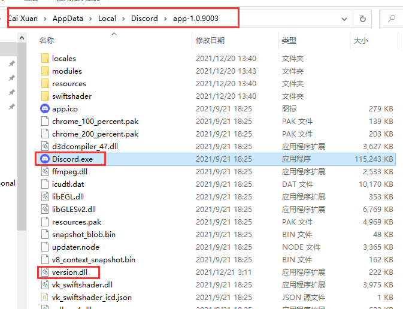
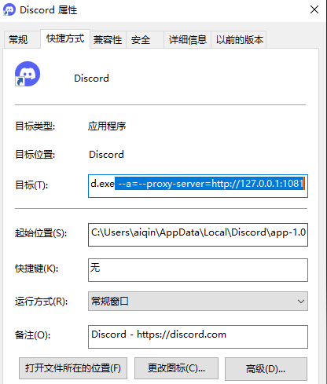

# discord-proxy


上篇文章中的方法已经失效了很久，也时不时有人问是否有别的设置方法，看了一圈，发现并没有比较独立的设置代理的方案，最简单的是设置系统环境变量来实现updater.node的代理，但是这个设置会影响所有系统的控制台程序。

所以我就自己实现了一个DLL劫持方案。

简单来说原理是version.dll会在Discord.exe启动时跟随加载，读取并存储命令行中的代理地址(http....)，并且拦截Discord的updater.node模块读取环境变量的操作，将命令行中的代理地址直接返回，这样就无需修改系统的环境变量。

## 开始使用
方法非常简单，在此下载release.zip并解压version.dll
https://github.com/aiqinxuancai/discord-proxy/releases

将version.dll放在Discord.exe所在目录（如Discord有更新，则可能需要重新放一下）
<p align="center" color="#6a737d">

</p>


然后在桌面的快捷方式按照上次添加的代理地址（Discord安装时自动创建的那个快捷方式，不要自行从Discord.exe创建，具体请见底部）
<p align="center" color="#6a737d">

</p>

注意最前面有个空格，地址请根据自身情况调整
```
 --a=--proxy-server=http://127.0.0.1:1081
```
如此就设置完毕了，使用桌面快捷方式运行即可。

---
### **如果你还是进不去，请看这里：**

#### **检查快捷方式对不对**
上面所说的桌面快捷方式为安装时自动创建的快捷方式，目标指向是**Update.exe**，而非自行从Discord.exe所创建的，修改完毕后的完整命令行样例：
```
C:\Users\xxxxxx\AppData\Local\Discord\Update.exe --processStart Discord.exe --a=--proxy-server=http://127.0.0.1:1081
```
#### **注意代理规则**
如果用的**clash代理**，请注意下代理规则，检查discord相关域名流量是否通过代理，v2、ss、ssr为指定端口全代所以不用另外做什么。

#### **不支持Socks代理**
目前不支持socks代理，请使用http代理，如果实在是需要，可以用此项目将socks代理转为http代理：https://github.com/ginuerzh/gost
